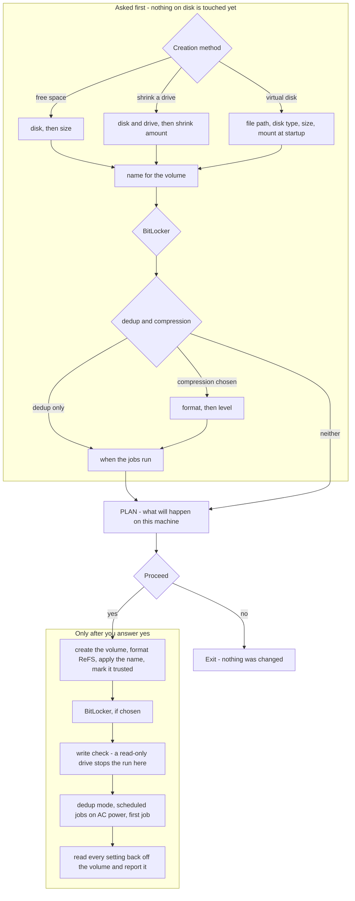

# Windows 11 Dev Drive Creation Script

_An interactive PowerShell script that guides users through creating Windows Dev Drives with customizable BitLocker encryption and ReFS deduplication settings._

A Dev Drive is a ReFS volume that Windows marks as trusted, so Microsoft Defender runs against it in performance mode instead of scanning every file synchronously - which is why source trees, package caches and build output belong on one. Windows 11 can create one from Settings; this script creates one from a PowerShell prompt, which is what you need when Settings cannot be launched elevated, and adds the parts Settings does not: BitLocker, ReFS deduplication and compression, and the recurring optimization jobs.

It can take the space from unallocated free space on a disk, by shrinking an existing volume, or from a `.vhdx` file. It asks every question first and changes nothing until you approve a written plan.

**This script automates work you are expected to be able to do by hand: it assumes you understand what it touches - partitions, ReFS, BitLocker and scheduled tasks - and that you can carry out and reverse every step yourself. It does not resume after a failure and undoes nothing for you, so it is not a tool for learning any of that.**

## Requirements

- **Windows 11 26100 or newer**
- **Administrator privileges**. The script declares `#Requires -RunAsAdministrator`, so PowerShell refuses to start it from a non-elevated prompt
- **Windows PowerShell 5.1 or PowerShell 7.**
- **50 GB minimum** - the selected disk's free space, the drive's shrinkable space, or the requested `.vhdx` size must be at least 50 GB, the documented Dev Drive minimum. The script stops when a disk or drive cannot offer that much, and re-asks when a size you type is too small

## Running it

```powershell
.\dev_drive.ps1
```

Open PowerShell as administrator first - Win+X, then **Terminal (Admin)** - and run it from there. The Explorer context menu offers "Run with PowerShell", which is not elevated and will not work.

A full run, from the first question to the finished drive:

https://github.com/user-attachments/assets/e5e97018-6966-4c64-8aaf-08764670f31f

## What it asks, and in what order

1. **Creation method**: free space on a disk, shrinking an existing drive, or a `.vhdx` file
2. **Drive selection**: shows every physical drive with its size, and either its largest unallocated block or, for a partition style this script does not work with, why it cannot be used
3. **Size**: minimum 50 GB; in free-space mode press Enter for the maximum
4. **Name**: what the volume is called, or Enter for `DevDrive`
5. **BitLocker**: optional, with the recovery key shown and acknowledged before the run goes on - except on a machine that denies writes to unencrypted fixed drives, where it is effectively mandatory and the run says so
6. **Deduplication**: deduplicate only, deduplicate and compress, compress only, or neither
7. **Compression**: LZ4 or ZSTD at the level Windows picks, or set the format and level yourself
8. **Schedule**: keep the suggested times, or set them yourself
9. **Plan**: everything you chose, written out as it will happen on this machine, and a yes/no. Nothing on disk has changed before this point

In virtual hard disk mode step 2 is skipped; instead you are asked for the file path, the disk type, the size and whether to mount the file automatically on startup. There is no press-Enter-for-maximum there, and the size has a 50 GB floor. See [Virtual hard disk mode](#virtual-hard-disk-mode).



### The plan you approve

Everything above produces one screen, and nothing on disk has changed when it appears:

```
===============================================================================
                        DEV DRIVE CREATION PLAN
===============================================================================

* Shrink Drive D (ALERT) by 199 GB to free up space
* Create 249 GB Dev Drive on Disk 1 (CT4000P3PSSD8) using ReFS
  50 GB of unallocated space already sits next to drive D and will be taken
  as well, so the Dev Drive comes out 249 GB rather than the 199 GB being freed.
* Name the Dev Drive Projects
* Skip BitLocker encryption
* Enable ReFS deduplication and ZSTD compression, level 2
* Daily optimization : Monday-Friday at 17:00
* Weekly maintenance : Monday at 17:30, every 1 week
* Mark Dev Drive as trusted for Windows Defender performance
* Run initial optimization job to prepare the drive

===============================================================================

WARNING: This will make permanent changes to your disk configuration.
   Make sure you have backups of important data before proceeding.

Are you ready to proceed with Dev Drive creation? (yes/no):
```

The plan says what will happen on *this* machine, not what usually happens: the BitLocker lines name what this machine can actually carry, and the schedule lines name the times you settled on.

After the drive exists, every setting is read back off the volume and reported - the trusted designation with `fsutil devdrv query`, the name and the deduplication settings from the volume itself - rather than assumed from commands that did not complain. The run ends by triggering a first optimization job and tells you to let it finish; it can take a while, and closing the window early leaves the drive unoptimized.

## Caveats

- **Physical disks must already be partitioned, as GPT or MBR.** Any other partition style - including `RAW`, which is what a disk out of the box reports, and what Windows reports for a partition table it cannot read - is refused at the disk prompt, and you are returned to it to pick another disk. The refusal says what Windows reported, offers the `Initialize-Disk` command as a condition rather than an instruction, and warns that running it writes a new partition table and makes every file already on the disk unreachable. The script never initializes a physical disk itself; it does initialize the virtual disk it creates in `.vhdx` mode, because it made that file moments earlier
- **No resume and no undo.** A run that fails part-way leaves whatever it already created. It names what it left behind and what a rerun would repeat, but it will not clean up for you
- **On a machine that denies write access to unencrypted fixed drives, BitLocker is not optional.** The setting is `FDVDenyWriteAccess` under `HKLM\SYSTEM\CurrentControlSet\Policies\Microsoft\FVE`. Without encryption the new drive mounts read-only and the run stops at the write check, having already made the partition. The run reads that setting and says so before the BitLocker question
- **Windows may open its own encryption prompt** on such a machine while the script is already encrypting. Leave it alone - answering it only produces "BitLocker encryption already enabled"
- **A BitLocker failure does not end the run.** It offers retry, carry on without it, or stop, and says what state the drive is in either way. A refusal by group policy is not offered a retry that would meet the same refusal
- **The recovery key is printed once and must be acknowledged.** Outside Entra ID it exists nowhere but on the volume and on the paper you write it on. A password is asked for in virtual hard disk mode only, and must be complex - 8 to 256 printable ASCII characters with upper, lower, digit and special. Every one of those is a refusal BitLocker answers by its own error code, so a password this accepts is not one Windows is known to reject
- **Where automatic unlocking cannot be set up** - Windows requires the operating system drive to be BitLocker-protected first - the drive has to be unlocked by hand after every restart
- **A `.vhdx` carried to another machine loses its trusted designation.** See [Carrying the file to another machine](#carrying-the-file-to-another-machine)
- **Do not run `compact vdisk` against a deduplicated `.vhdx`** without a backup. See [BitLocker and deduplication inside a virtual hard disk](#bitlocker-and-deduplication-inside-a-virtual-hard-disk)

### Removing a Dev Drive

The script does not remove anything, and undoing a run means three separate things:

- **A drive on a partition**: delete the volume in Disk Management and merge the space back into the volume it came from
- **A `.vhdx`**: `Dismount-DiskImage -ImagePath '<path>'`, then delete the file. That also clears its startup registration
- **The scheduled jobs**: they live under `Task Scheduler Library > Microsoft > Windows > ReFsDedupSvc` and are not removed with the drive

## Virtual hard disk mode

Instead of repartitioning a physical disk, this mode puts the Dev Drive inside a `.vhdx` file on a volume you already have. It is the same thing Windows Settings offers as **Create new VHD**, which is useful when the Settings app is not an option - for example on machines where elevation comes from a tool that cannot launch Settings elevated.

The script asks for four things:

- **Path** of the `.vhdx` file. The folder must already exist, the file must not, and the volume hosting it must be a fixed disk - Windows does not support a Dev Drive inside a `.vhdx` on a removable disk. A per-user directory keeps the Dev Drive from being shared unintentionally.
- **Disk type**. *Dynamically expanding* grows as data is written and is what Microsoft recommends. *Fixed size* claims the whole file up front, which takes minutes rather than seconds and cannot be interrupted once started.
- **Size**, at least 50 GB. That is Microsoft's documented minimum for any Dev Drive. For a fixed size disk the size cannot exceed the host volume's free space less 1 GB of head-room; for a dynamically expanding one a larger limit is allowed with a warning.
- **Automatic mounting** on startup.

The file is created and attached through `virtdisk.dll` directly, not with `diskpart` or `Mount-DiskImage`. The reason is automatic mounting, described below. Everything after that - ReFS formatting, the trusted flag, BitLocker, deduplication - is identical to the other two modes.

### Automatic mounting

A `.vhdx` attached the ordinary way does not survive a restart, and no PowerShell cmdlet can change that. Automatic mounting has to be requested when the disk is attached, by passing `ATTACH_VIRTUAL_DISK_FLAG_AT_BOOT` to [`AttachVirtualDisk`](https://learn.microsoft.com/en-us/windows/win32/api/virtdisk/nf-virtdisk-attachvirtualdisk). Neither `diskpart` nor `Mount-DiskImage` passes it; until now only the Windows Settings **Disks & volumes** page did, which is why a Dev Drive created there comes back after a restart and one created from a script does not.

The script calls that API itself. Windows then records the file under `HKLM\SYSTEM\CurrentControlSet\Control\AutoAttachVirtualDisks` on its own and reattaches it on every startup, with the same drive letter and its trusted Dev Drive status intact. That registry entry is Windows's own bookkeeping - writing it by hand does not enable anything.

Older Windows builds may reject the flag. If that happens the script says so, attaches the disk anyway, and you get a working Dev Drive that needs mounting by hand after each restart.

Whenever the disk will not be mounted for you - because Windows refused the flag, or because you declined automatic mounting - the script prints the command, once when the disk is attached and again at the end so it does not scroll away:

```powershell
Mount-DiskImage -ImagePath 'D:\DevDrive.vhdx' -StorageType VHDX -Access ReadWrite
```

Run it from a PowerShell started as administrator. Microsoft's [`Mount-DiskImage` reference](https://learn.microsoft.com/en-us/powershell/module/storage/mount-diskimage) states that mounting a virtual hard disk requires administrator privileges, unlike mounting an `.iso` file.

### Carrying the file to another machine

Microsoft's [Dev Drive documentation](https://learn.microsoft.com/en-us/windows/dev-drive/) advises against it: when a virtual hard disk is hosted on a fixed disk - which this mode requires - it is not recommended to copy it, move it to a different machine and carry on using it as a Dev Drive.

The reason is that the designation, trust status included, is stored per machine and does not travel with the file. Mounted somewhere else, the `.vhdx` comes up as an ordinary ReFS volume: every filter attaches and Microsoft Defender scans it synchronously. Nothing announces this - the drive works, it is simply slower than the one you left behind.

If you move it anyway, mount it on the new machine and mark it trusted there:

```powershell
fsutil devdrv trust /f D:
```

The script prints the same advice at the end of every run that creates a `.vhdx`.

### BitLocker and deduplication inside a virtual hard disk

Microsoft's documentation states that a `.vhdx` is already covered by BitLocker on the volume that hosts it, and that enabling BitLocker on the mounted virtual disk is unnecessary. The script says so before asking, but leaves the choice to you.

Deduplication works on the ReFS volume inside the file and frees space there as it does on a partition. The `.vhdx` file itself does **not** shrink - it keeps the largest size it has ever reached, and a deduplication run adds a little to it for its own bookkeeping.

Reclaiming that space on the host means compacting the file, and there are reports of data corruption when compacting a `.vhdx` whose contents are deduplicated. Do not run `compact vdisk` against a deduplicated Dev Drive without a backup.

## Scheduled optimization jobs

By default the script creates one daily deduplication job and one weekly maintenance job:

- 17:00 daily, Monday-Friday, **only on AC power** (2 hours duration, 60% CPU limit)
- Monday at 17:30 weekly (maintenance pass, every week)

**One daily start time, because a volume holds one.** `Set-ReFSDedupSchedule` replaces a volume's schedule rather than adding to it, so a second time can only ever overwrite the first. Task Scheduler will let you add further triggers to the daily task by hand, but nothing here reports them back, the next time a schedule is written for the drive they are removed, and whether the optimization actually runs on a trigger added that way has not been confirmed.

The daily start time and the weekly day and time are asked for during the run; everything else about the jobs is fixed. They live under `Task Scheduler Library > Microsoft > Windows > ReFsDedupSvc`, which is where you change the times later - the script prints that path once at the end of a run.

In compress-only mode there is no weekly maintenance job and no duration or CPU limit on the daily one: Windows refuses those settings on a volume that only compresses, and accepts a duration only to drop it. The run creates the daily job on AC power and says the weekly one is being skipped.

## Troubleshooting

- **Windows will not shrink the volume far enough.** Shrinking stops at the last written file block, so fragmentation limits it regardless of free space. The script shows the real limit Windows reports and suggests a third-party tool where that is not enough
- **Shrink mode takes the whole free run behind the drive, and says so before you agree.** The volume gives up exactly the amount you asked to free, and the Dev Drive then fills everything unallocated immediately behind it - the space just freed plus anything already sitting there. The plan names the resulting size and where the extra came from - or, on the rare drive whose limits Windows will not report, says the size shown is only a floor. Unallocated space elsewhere on the disk is never touched
- **The drive comes up read-only.** That is `FDVDenyWriteAccess` - see [Caveats](#caveats). Enable BitLocker, or clear the setting if it is yours to clear
- **The `.vhdx` is gone after a restart.** Windows refused `ATTACH_VIRTUAL_DISK_FLAG_AT_BOOT`, or automatic mounting was declined. Mount it by hand with the command the script printed
- **A run failed part-way.** It names what it left behind - a `.vhdx` still attached, or a volume already shrunk. Undo that before running again: a rerun starts from the beginning and would shrink the drive a second time

More on Dev Drive at https://learn.microsoft.com/en-us/windows/dev-drive/

## Contributing

Run `install-hooks.cmd` once to enable the tracked pre-commit hook in `.githooks/`. It runs the same three checks as CI - parse, PSScriptAnalyzer, Pester - against your working tree and refuses the commit if any fails. `AGENTS.md` has the conventions and the traps.

CI runs the checks under PowerShell 7 only

## License

GPL-3.0. See [LICENSE](LICENSE).
